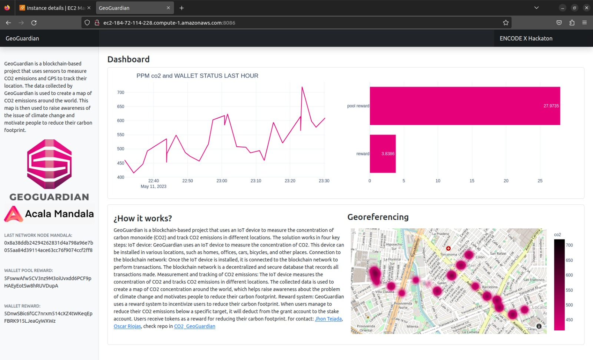
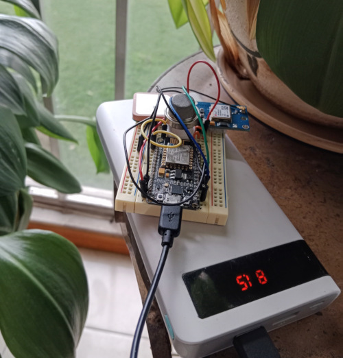
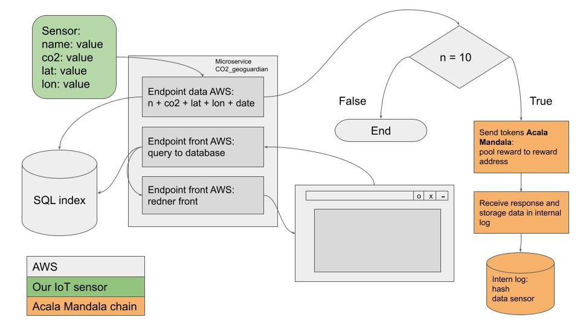

# GeoGuardian encodex_hackathon
In this repository there is all the code for the participation in the Encode X hackathon, the information of the hardware that the technologies were designed and the front the demo can be seen at: <http://ec2-184-72-114-228.compute-1.amazonaws.com:8086/>

## How does it work?
GeoGuardian is a blockchain-based project that uses an IoT device to measure the concentration of carbon monoxide (CO2) and track CO2 emissions in different locations. The solution works in four key steps:
IoT device: GeoGuardian uses an IoT device to measure the concentration of CO2. This device can be installed in various locations, such as homes, offices, cars, bicycles, and other places.
Connection to the blockchain network: Once the IoT device is installed, it is connected to the blockchain network to perform transactions. The blockchain network is a decentralized and secure database that records all transactions made.
Measurement and tracking of CO2 emissions: The IoT device measures the concentration of CO2 and tracks CO2 emissions in different locations. The collected data is used to create a map of CO2 concentration around the world, which helps raise awareness about the problem of climate change and motivates people to reduce their carbon footprint.
Reward system: GeoGuardian uses a reward system to incentivize users to reduce their carbon footprint. When users manage to reduce their CO2 emissions below a specific target, it will deduct from the grant account to the stake account. Users receive tokens as a reward for reducing their carbon footprint. for contact: 
<a href="mailto:jhonteajada95@gmail.com">Jhon Tejada</a>, <a href="mailto:oscarriojas@gmail.com">Oscar Riojas</a>, check repo in <a href="https://github.com/jhontejada95/CO2_GeoGuardian">CO2_GeoGuardian</a>

## Hardware
The microcontroller that was used is an ESP32 due to its low energy consumption and that it has a built-in Wi-Fi connection. To measure the CO2 level, an MQ135 sensor connected to one of the analog inputs was used.

* MICRO ESP8266: <https://electronilab.co/tienda/nodemcu-board-de-desarrollo-con-esp8266-wifi-y-lua/>
* CO2 MQ135:   <https://components101.com/sensors/mq135-gas-sensor-for-air-quality>
* GPS neo-6m:  <https://naylampmechatronics.com/sensores-posicion-inerciales-gps/106-modulo-gps-neo-6m.html>

## Software
The entire backend of the application is built in python using the library <https://github.com/polkascan/py-substrate-interface> for the connection to the blockchain, fastAPI to create the endpoints, the front is built with Bootstrap and the test network used is Mandala de Acala

## Infrastructure
The application uses an AWS Free Tier EC2 instance and an AWS SQL RDS database also in the Free Tier.

## Video demo
El demo se puede ver en: <https://www.youtube.com/watch?v=rAjoWlaW4j8>
